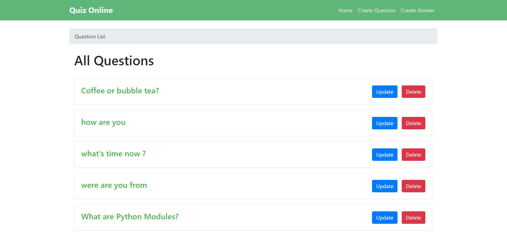
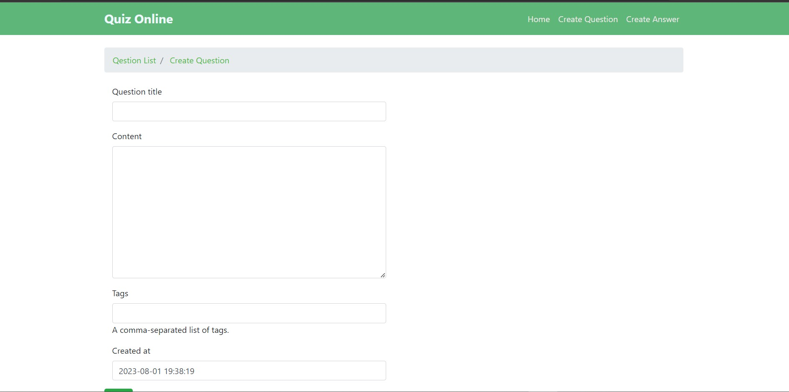
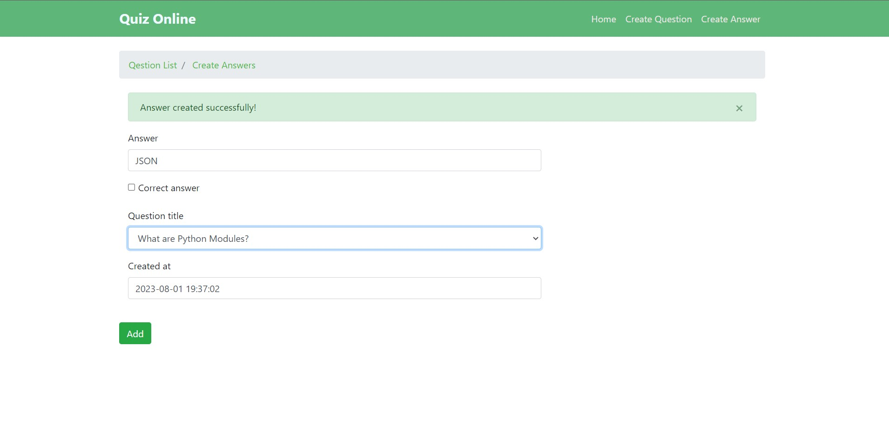
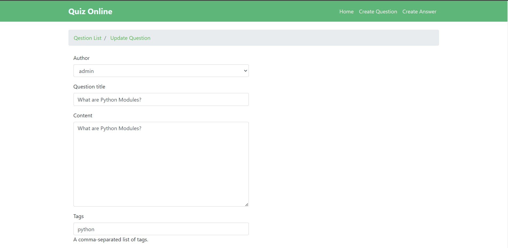
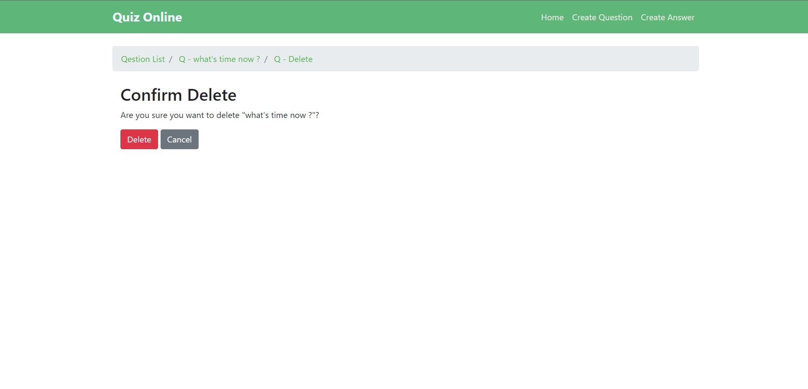
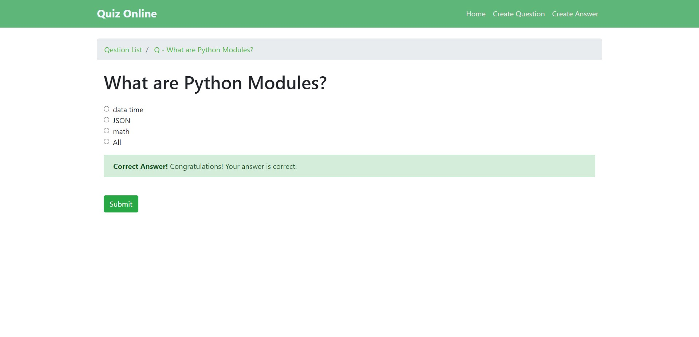
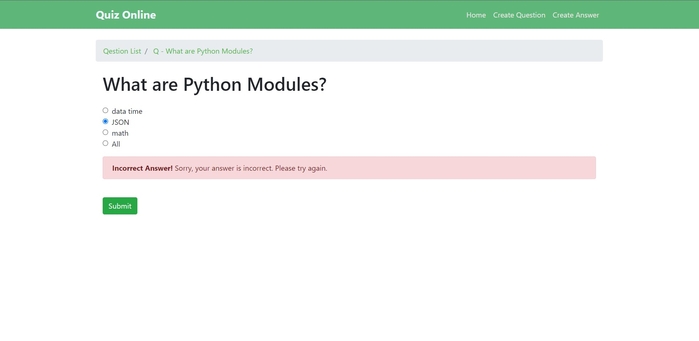

# `Task1 (Quiz project)`

`This repository contains a Quiz project developed using Django. Below are the steps to install and set up the project.`

### `How to Install`

1. `Create a virtual environment (venv) for the project:`

   ```
   Copy code
   py -m venv name_venv
   ```

2. `Change the directory to the newly created virtual environment:`

   ```
   bashCopy code
   cd name_venv
   ```

3. `Activate the virtual environment (for Windows):`

   ```
   Copy code
   Scripts\activate
   ```

4. `Install Django using pip:`

   ```
   Copy code
   pip install Django
   ```

5. `Install the project dependencies from the requirements.txt file:`

   ```
   Copy code
   pip install -r requirements.txt
   ```


### Screenshots

Here are some screenshots of the application's pages:

#### Home Page (Or All Questions)


#### Create Question


#### Create Answer


#### Update Question


#### Delete Question


#### Correct Answer

#### Wrong Answer

